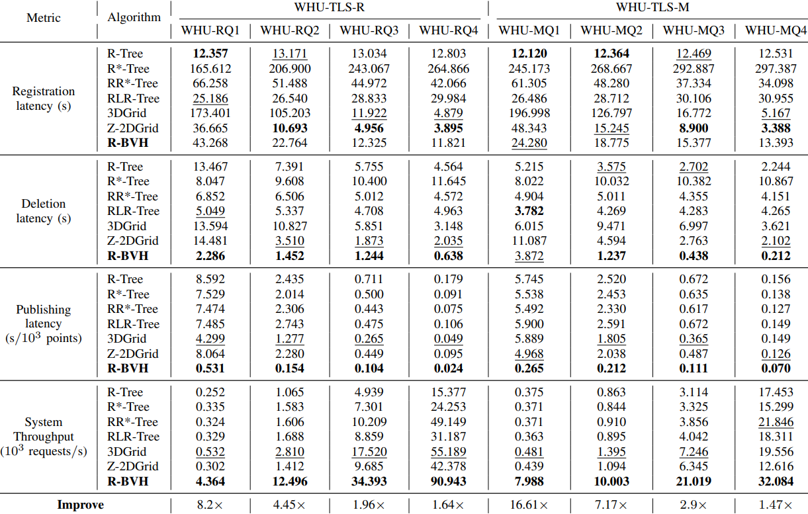

# PC-PS: A Publish/Subscribe System for Streaming Point-Cloud Data with Continuous Range Queries

This repository contains the source code for **PC-PS**, a high-performance publish/subscribe system for processing massive streaming point-cloud data with continuous range (CR) queries. This work was proposed in our paper:

---

## 🔍 Overview

PC-PS addresses the challenges of real-time point-cloud data processing in dynamic environments. It features:

- **R-BVH Index**: An incremental spatial index with 2ⁿ-ary tree and Morton encoding.
- **Code Coverage Registration**: A hybrid query insertion algorithm allows CR quey to register in both leaf and non-leaf nodes of R-BVH.
- **Two-Phase Matching**: Efficient data-query matching via `Filter-and-Construct` and `Match-and-Update` stages.
- **Parallel Processing**: Multi-core adaptive workload balancing during query registration and data publishing.

---

## 📊 Datasets
We evaluate PC-PS on two real-world datasets: 

- **WHU-TLS** (dense & sparse terrestrial LiDAR, including WHU-TLS-R and WHU-TLS-M): http://3s.whu.edu.cn/ybs/en/benchmark.htm 

- **Paris-Lille-3D** (nD urban street LiDAR): https://npm3d.fr/paris-lille-3d

---

## 🔔 Post-Publication Update (Important)
This issue has been fixed in the current version.  
The updated implementation can be found in the `PCPS/` directory.

We have rerun the experiments reported in Table I of the paper, including:
- Query Registration
- Query Deletion
- Data Publishing
- System Throughput

The updated results are provided below.

> Note: This update does not affect the conclusions of the paper, PC-PS continues to consistently outperform all baselines on System Throughput.

